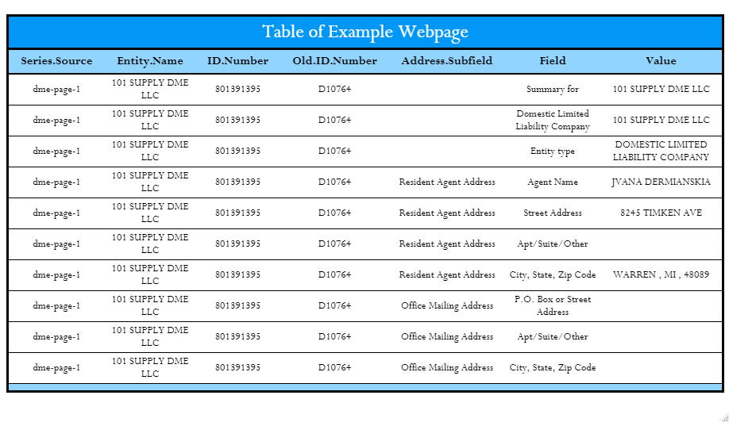

# Data-Mining-DoRA

Data mining Michigan's Department of Licensing and Regulatory Affairs for particular healthcare institution information.

# Main page of Michigan's LARA to search for business entities

The areas that are encapsulated with red are interacted with Selenium to alter them to the following:

# Visual of Search

This is a cropped version of a page from the search to be readable. Each page of the search is saved within a folder, within in code is the static-files/webpages folder. These will then be utilized with R's rvest package to utilize the embedded html element to then scrap individual entities information from search. The following is a webpage that would be scrapped of its relevant elements.

# Individual Enitity Example

# Scrapped elements within table

